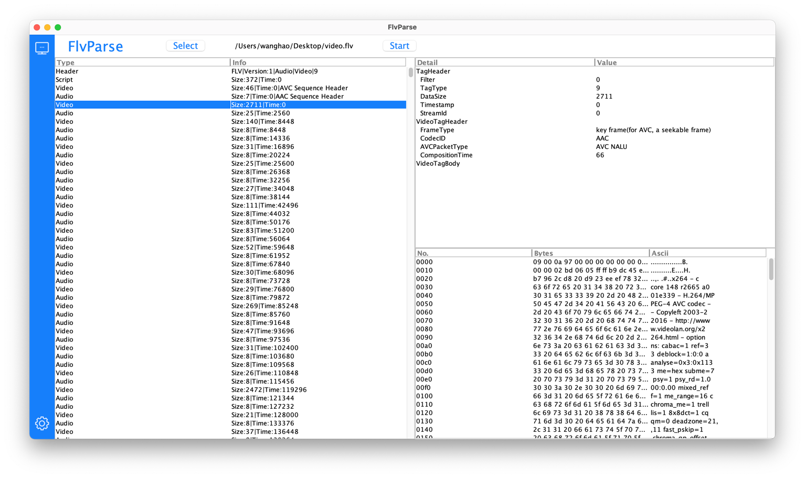

## FlvParse

FlvParse is a desktop app which shows Flv file structures.

### Download
For macOS, an executable is available [here](https://github.com/hunterwyld/FlvParse/releases/download/v1.0.0/FlvParse.app.zip)

For other OS:
```
git clone https://github.com/hunterwyld/FlvParse.git
cd FlvParse
mvn clean package
java -jar target/flvparse.jar
```

### Snapshot


> Thanks to [jar2app](https://github.com/Jorl17/jar2app) which makes it easy for converting a jar file to macOS app.